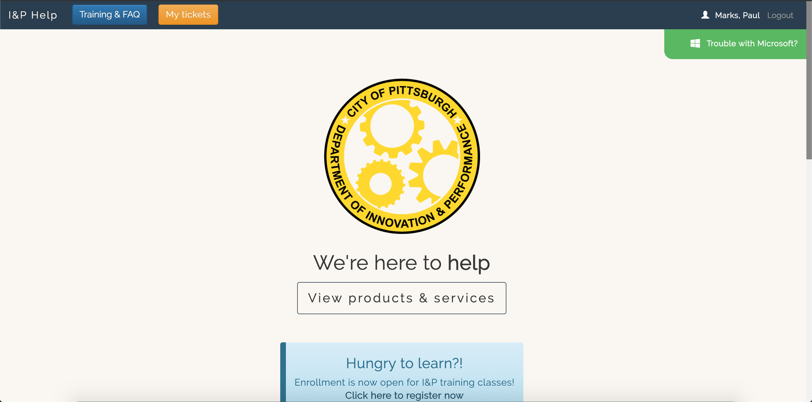

# I&P Help

I&P Help is the help desk site used by the Department of Innovation & Performance (I&P) at the City of Pittsburgh.  I&P uses [OTRS](https://otrs.com/) as a ticketing system, but the particular implementation of OTRS lacks flexibility in IT service management.  I&P Help fills that void by providing a flexible UI, customized forms, and business logic for various workflows involved in IT service delivery.  

I&P Help interfaces with OTRS via the [sendgrid-proxy](https://github.com/CityofPittsburgh/sendgrid-proxy).  Where additional data or administrative interfaces are nneeded, I&P Help interfaces with Sharepoint via the [365-proxy](https://github.com/CityofPittsburgh/365-api).  Where document storage needs to be provided, I&P Help  interfaces with an Azure blob via [blobby](https://github.com/CityofPittsburgh/blobby).



## A note on boilerplate

The bones of I&P Help are shared across all client applications developed by Paul Marks for the City of Pittsburgh.  For more in-depth documentation on the structure,  design choices, authentication flow, and installation procedures for this application, please see the documentation for the [boilerplate](https://github.com/CityofPittsburgh/react-typescript-boilerplate).

This README will focus only on the components of this application that are unique to I&P Help.

## Structure
    ...
    app
    ├── src                         
        ├── components        
            |── accessControl           # Injectable access control component, limits certain services to I&P "liaisons"
            |── courseRegistration      # All markup and functions involved in registering for I&P courses/classes
            |── FAQ                     # Frequently asked questions
            |── services                # All OTRS services provided through I&P Help
        ├── store                   
            |── courseRegistrations     # All course registration records
            |── courses                 # All upcoming courses/classes being provided
            |── equipment               # All equipment available for loan
            |── equipmentLoan           # All equipment loan records
            |── liaisons                # Store of I&P liaisons

## Running Locally

### Prerequisites

* [Node.js](https://nodejs.org) - JS runtime
* .env - See .env.example for all required secrets

### Installation
```
git clone https://github.com/CityofPittsburgh/IP-help
cd IP-help
// first, install dependencies for the server
npm install
// then, install dependencies for the client
cd app
npm install
// to run the app locally and bypass auth
npm start
// to bundle the app for deployment
npm run build
// to run the app from the minified build, with auth workflow
cd ..
node server.js
```

## Deployment

Both staging and production services are hosted in Azure.  Application is deployed directly from github, and can be triggered either (a) through the Azure GUI, (b) through the [CLI](https://docs.microsoft.com/en-us/cli/azure/webapp/deployment/source?view=azure-cli-latest#az-webapp-deployment-source-sync), or (c) through the [proxy service](https://github.com/CityofPittsburgh/azure-proxy).

For complete documentation on the azure environment, see [here](https://github.com/CityofPittsburgh/all-things-azure.git).

## License

This project is licensed under the MIT License - see the [LICENSE.md](LICENSE.md) file for details